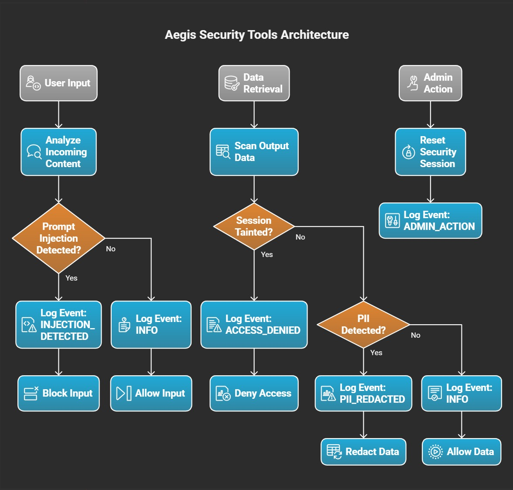

# 🛡️ Aegis: Anti Gen-AI Defense Framework

An extensible middleware framework designed to protect Generative AI systems from prompt injection, data exfiltration, and other malicious inputs.

## Problem Statement

Generative AI systems are increasingly integrated into enterprise workflows, but they are vulnerable to prompt injection attacks—malicious inputs designed to override instructions, exfiltrate sensitive data, or manipulate model behavior. These attacks can compromise data confidentiality, model integrity, and business trust. Organizations need proactive solutions to detect, prevent, and mitigate prompt injection threats without degrading AI usability.

## Architecture

The Aegis framework is composed of three core components that work together to provide a robust security layer for any AI agent.

*   **Aegis Security Middleware (`server.py`):** A standalone, data-agnostic security service that runs in the background. It exposes a set of tools that any agent can call to scan and sanitize data. It is launched automatically by the Antigravity MCP environment.
*   **Dynamic Configuration (`config.json`):** All security rules, thresholds, and detection patterns are managed in this central file. The server reloads this configuration on every tool call, ensuring that changes take effect instantly without a restart.
*   **Monitoring Dashboard (`dashboard.py`):** A real-time web interface powered by Streamlit that visualizes all security events as they are logged by the middleware.

### Architecture Diagram



## Features

*   **Configurable Prompt Injection Scanning:** Enable, disable, and tune the sensitivity of the prompt injection detector.
*   **Context-Aware Access Control:** A "tainted session" flag tracks malicious inputs and can be used to block subsequent sensitive operations.
*   **Extensible PII Redaction:** The framework scans for sensitive data (PII) and can be configured with custom regex patterns to detect proprietary or unique data formats.
*   **Real-time Event Logging:** All security decisions are logged to `security_events.json` for auditing and monitoring.
*   **Administrative Control:** Includes a tool to manually reset a tainted security session.

## Setup and Installation

1.  Ensure all dependencies are installed from the `requirements.txt` file:
    ```bash
    pip install -r requirements.txt
    ```

## How to Use

The Aegis framework is designed to be run by an MCP environment like Antigravity and monitored with the standalone dashboard.

1.  **Run the Monitoring Dashboard (Optional):**
    To view security events in real-time, run the following command in a separate terminal:
    ```bash
    streamlit run dashboard.py
    ```

2.  **Use Your MCP Environment:**
    Your MCP environment, as defined in your configuration, will automatically launch the `server.py` middleware in the background. You do not need to run it manually.

3.  **Intended Agent Workflow:**
    An agent should use the Aegis tools as security checkpoints in its logic:
    ```python
    # 1. An untrusted user prompt is received
    user_prompt = "generate a python code to print a factorial of a inputted number"

    # 2. Analyze the incoming prompt for threats
    scan_result = agent.promptcheck_aegis.analyze_incoming_content(content_to_scan=user_prompt)

    # 3. Check the result before proceeding
    if not scan_result['is_valid']:
        return "Request blocked due to security alert."

    # 4. The agent can now safely perform its own logic (e.g., query a database)
    # This is where the agent gets its data. Aegis does not touch the database.
    raw_data_from_db = "Factorial of 5 is 120" 

    # 5. Before showing data to the user, scan it for sensitive PII
    output_scan_result = agent.promptcheck_aegis.scan_output_data(data_to_scan=raw_data_from_db)

    # 6. Return the sanitized data
    return output_scan_result['sanitized_data']
    ```

## Configuration

The framework's behavior is controlled by `config.json`.

*   `"enable_prompt_injection_scanner"`: Set to `false` to disable the aggressive prompt injection scanner if it produces too many false positives for your use case.
*   `"prompt_injection_threshold"`: A value from `0.0` to `1.0`. Higher values are more strict.
*   `"pii_entities_to_scan"`: A list of entity types for the PII scanner to look for (e.g., `PHONE_NUMBER`, `CREDIT_CARD`).
*   `"custom_regex_patterns"`: Define your own patterns to find and redact sensitive data. The `name` must be included in `pii_entities_to_scan` to be active.

```json
{
    "name": "GENERIC_SECRET",
    "expressions": ["SECRET-[A-Z-]*"],
    "context": ["secret"],
    "score": 0.8
}
```